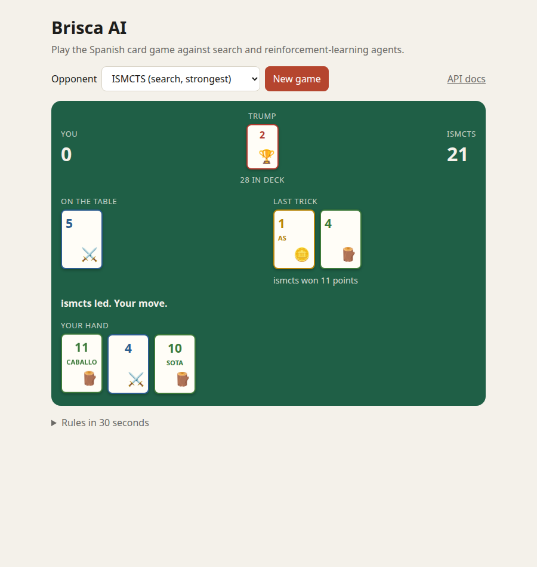
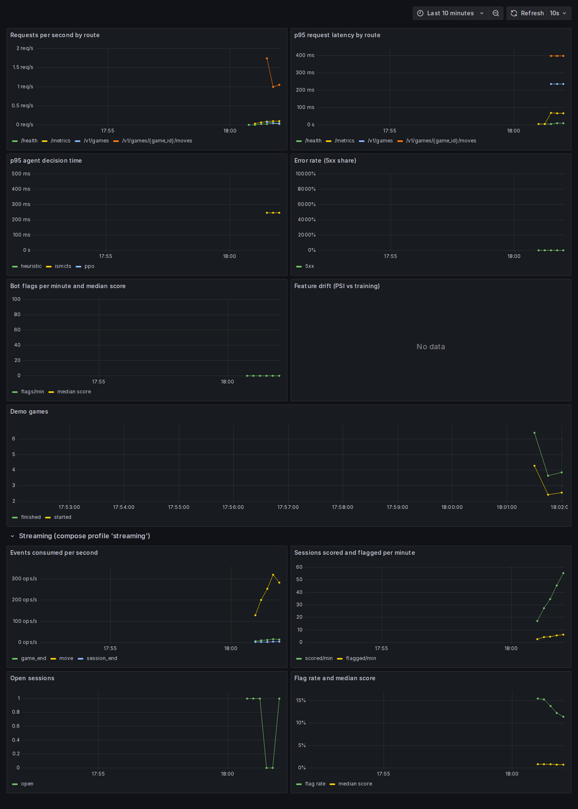

# Brisca AI

[](https://github.com/apayne185/Brisca-AI-Player/actions/workflows/ci.yml)
[](https://github.com/apayne185/Brisca-AI-Player/actions/workflows/codeql.yml)
[](https://github.com/apayne185/Brisca-AI-Player/actions/workflows/docker.yml)

[](https://github.com/astral-sh/ruff)
[](https://mypy-lang.org/)
[](LICENSE)

An imperfect-information game AI platform for **Brisca**, the Spanish trick-taking
card game. It covers the full ML lifecycle: a fast and correct simulator, search
and reinforcement-learning agents, statistically sound evaluation, tracked
experiments, an inference service, and a bot-detection model trained on
gameplay telemetry.

<p align="center"></p>

## Quickstart

Play against the agents, with Prometheus and a Grafana dashboard alongside:

```bash
docker compose up --build    # demo and API on :8000, Grafana on :3000
```

Or develop locally with [uv](https://docs.astral.sh/uv/):

```bash
git clone https://github.com/apayne185/Brisca-AI-Player.git
cd Brisca-AI-Player
make install   # environment, dev tools and git hooks
make check     # lint, strict type checking and tests, exactly as CI runs them
```

See the [roadmap](docs/ROADMAP.md) for how the project was built, phase by phase.

## Leaderboard

Round robin between every agent: 100 duplicate deals per pairing (200 games),
the same deals for every pairing, 5,600 games in total.

<!-- leaderboard:start -->
Bradley-Terry ratings on the Elo scale, anchored at `random` = 0, with 95% bootstrap intervals from resampling deals.

| Rank | Agent | Elo | 95% CI | Score | Avg points | ms / move |
| ---: | --- | ---: | :---: | ---: | ---: | ---: |
| 1 | `ismcts` | +410 | [+379, +443] | 0.651 | 62.0 | 240.00 |
| 2 | `alphabeta` | +395 | [+368, +426] | 0.629 | 66.7 | 78.84 |
| 3 | `heuristic` | +344 | [+313, +378] | 0.552 | 62.8 | 0.01 |
| 4 | `heuristic-tuned` | +342 | [+312, +373] | 0.549 | 63.1 | 0.01 |
| 5 | `ppo-v2` | +337 | [+309, +370] | 0.543 | 62.9 | 8.98 |
| 6 | `ppo-v1` | +310 | [+280, +340] | 0.502 | 61.5 | 6.02 |
| 7 | `greedy` | +278 | [+247, +311] | 0.453 | 60.3 | 0.01 |
| 8 | `random` | +0 | [+0, +0] | 0.121 | 40.7 | 0.00 |

Head-to-head score of the row agent against the column agent (± half-width of the 95% Wilson interval):

| | `ismcts` | `alphabeta` | `heuristic` | `heuristic-tuned` | `ppo-v2` | `ppo-v1` | `greedy` | `random` |
| --- | :---: | :---: | :---: | :---: | :---: | :---: | :---: | :---: |
| `ismcts` | - | 0.56 ± 0.07 | 0.56 ± 0.07 | 0.57 ± 0.07 | 0.58 ± 0.07 | 0.70 ± 0.06 | 0.66 ± 0.07 | 0.93 ± 0.04 |
| `alphabeta` | 0.44 ± 0.07 | - | 0.56 ± 0.07 | 0.60 ± 0.07 | 0.60 ± 0.07 | 0.64 ± 0.07 | 0.63 ± 0.07 | 0.92 ± 0.04 |
| `heuristic` | 0.44 ± 0.07 | 0.44 ± 0.07 | - | 0.48 ± 0.07 | 0.52 ± 0.07 | 0.54 ± 0.07 | 0.58 ± 0.07 | 0.88 ± 0.05 |
| `heuristic-tuned` | 0.43 ± 0.07 | 0.40 ± 0.07 | 0.52 ± 0.07 | - | 0.49 ± 0.07 | 0.54 ± 0.07 | 0.61 ± 0.07 | 0.86 ± 0.05 |
| `ppo-v2` | 0.42 ± 0.07 | 0.40 ± 0.07 | 0.48 ± 0.07 | 0.51 ± 0.07 | - | 0.49 ± 0.07 | 0.64 ± 0.07 | 0.86 ± 0.05 |
| `ppo-v1` | 0.30 ± 0.06 | 0.36 ± 0.07 | 0.46 ± 0.07 | 0.46 ± 0.07 | 0.51 ± 0.07 | - | 0.57 ± 0.07 | 0.85 ± 0.05 |
| `greedy` | 0.34 ± 0.07 | 0.37 ± 0.07 | 0.42 ± 0.07 | 0.39 ± 0.07 | 0.36 ± 0.07 | 0.43 ± 0.07 | - | 0.85 ± 0.05 |
| `random` | 0.07 ± 0.04 | 0.08 ± 0.04 | 0.12 ± 0.05 | 0.14 ± 0.05 | 0.14 ± 0.05 | 0.15 ± 0.05 | 0.15 ± 0.05 | - |
<!-- leaderboard:end -->

**Takeaways.** Search wins: ISMCTS is the strongest agent and beats every
other agent head to head, with determinized alpha-beta close behind. But the
rule-based heuristic is within about 70 Elo of the top while being roughly
10,000× cheaper per move, which makes it the obvious choice wherever latency
or cost matters. Tuning moved PPO from below the heuristic (`ppo-v1`) to level
with it (`ppo-v2`), while the tuned heuristic is indistinguishable from the
hand-set defaults, which is consistent with its held-out validation below.
(Timings were measured with seven games running in parallel, so absolute
milliseconds are inflated; the ratios hold.)

Reproduce with `make tournament && make leaderboard`. Games are stored in DuckDB
(`results/brisca.duckdb`) and analysed in SQL; the raw games are published as
[`results/games.parquet`](results/games.parquet) and the agent settings are in
[`configs/tournament.toml`](configs/tournament.toml).

**How it is measured.** Ratings come from a Bradley-Terry model fitted by
maximum likelihood over all games and are shown on the Elo scale, so they do
not depend on game order the way incremental Elo does. Uncertainty comes from a
bootstrap that resamples whole deals within each pairing, which keeps each
duplicate pair together. Head-to-head cells use Wilson score intervals.

## Using the engine

The rules engine is a set of pure functions over an immutable `GameState`, so
search algorithms can branch from any state without copying.

```python
import random
from brisca import determinize, legal_actions, new_game, observe, step, winner

rng = random.Random(0)
state = new_game(seed=rng)
while not state.is_terminal:
    obs = observe(state, state.to_play)  # what the player to move can see
    sample = determinize(obs, rng)  # one consistent guess at the hidden cards
    state = step(state, rng.choice(legal_actions(state)))

print(state.scores, winner(state))
```

| Module | Responsibility |
| --- | --- |
| `brisca.cards` | Spanish deck, card points, trick-taking strength, stable card ordinals for ML encodings |
| `brisca.engine` | `new_game`, `legal_actions`, `step`, `trick_winner`, `winner`, `returns` |
| `brisca.observation` | Per-player information sets (`observe`) and uniform sampling of consistent hidden states (`determinize`) |

The engine is covered by table-driven rule tests and Hypothesis property tests
that check invariants in every reachable state: each card exists exactly once,
scores equal the points of won tricks, the face-up trump is drawn last, the
trick winner leads, and every game is a 120-point zero-sum game. Observations
are tested for leaks: resampling the hidden cards never changes what a player
sees. A random game runs in about 145 µs on one core (`make bench`).

## Agents

Every agent implements one protocol, `act(observation) -> card`, and only ever
sees what its player could see at the table.

| Agent | Approach |
| --- | --- |
| `random` | Uniformly random legal card, the baseline floor |
| `greedy` | One-ply: best immediate point swing, cheapest card otherwise |
| `heuristic` | Rule-based tactics with tunable parameters: bank points when winning in suit, save trumps for valuable tricks, trump freely in the endgame |
| `ismcts` | Single-Observer Information Set MCTS: searches over the player's information set using determinized samples and availability-aware UCB |
| `alphabeta` | Perfect Information Monte Carlo: alpha-beta over sampled determinizations, and exact once the stock is empty |

```python
from brisca.agents import make_agent
from brisca.arena import play_match

result = play_match(make_agent("ismcts", iterations=500, seed=0), make_agent("heuristic"), deals=50)
print(result.score)  # win rate with draws as half, over 100 duplicate games
```

Matches use **duplicate deals**: each shuffled deal is played twice with the
seats swapped, which cancels most of the luck of the cards. Search agents are
tested against exact solvers: alpha-beta pruning must match plain minimax, and
both search agents must play solved endgames optimally. A seeded strength suite
in CI checks that every agent clearly beats random play. Ratings with confidence
intervals come in Phase 3.

## Reinforcement learning

A PPO agent learns by self-play (`pip install 'brisca[rl]'`, then `brisca-train`).
Each training episode is played against an opponent drawn from a league: the
random, greedy and heuristic agents plus frozen snapshots of the learner. The
policy is an action-masked actor-critic over the 40 cards.

```bash
brisca-train --total-steps 3000000 --out models/ppo.pt   # ~25 min on one CPU core
```

After 3M steps (about 150k games), scored over 1,000 duplicate games against
each opponent, with 95% confidence intervals:

| Opponent | Score, per-output policy head | Score, shared per-card head |
| --- | --- | --- |
| random | 0.873 ± 0.021 | 0.875 ± 0.021 |
| greedy | 0.534 ± 0.031 | 0.546 ± 0.031 |
| heuristic | 0.444 ± 0.031 | 0.442 ± 0.031 |

With default hyperparameters (`ppo-v1`), PPO comfortably beats random play and
edges past the greedy agent, but not the hand-written heuristic. Tuned
hyperparameters (`ppo-v2`, see below) bring it level with the heuristic.

**What made it learn.** The first version stayed at random-level play however
it was tuned. Driving the environment with the greedy agent reproduced the
expected 0.86 score, which ruled out a reward or environment bug and pointed at
the input: with only one-hot card ids, the network had to rediscover which card
beats which from scratch. Adding two relational feature planes, *trump suit*
and *cards that beat the current trick*, took the agent from 0.52 to 0.74
against random within 100k steps. The shared per-card head (`--card-head`)
learns faster early on but converges to the same strength.

## Experiment tracking, tuning and the model registry

With the `mlops` extra (`pip install 'brisca[rl,mlops]'`), every training run is
tracked in MLflow: its config, learning curves and git commit, plus the trained
policy, logged as an MLflow pyfunc model with an explicit tensor signature so it
can be served as is.

```bash
brisca tune heuristic --trials 200 --workers 2 --out configs/heuristic-tuned.toml
brisca tune ppo --trials 24 --workers 5 --steps 400000 --out configs/ppo-tuned.toml
brisca-train --config configs/ppo-tuned.toml --total-steps 3000000 --register
mlflow ui --backend-store-uri sqlite:///mlflow.db                 # browse runs
```

**Champion gate.** `--register` (or `brisca promote <model or checkpoint>`)
registers the candidate as a new version of `brisca-ppo`. Candidate and
`@champion` then play the same 300 duplicate deals against a fixed reference
panel (greedy and heuristic), and the champion alias moves only if the
candidate does better on significantly more deals than it does worse (exact
one-sided paired sign test, α = 0.05). Rejected versions stay in the registry,
tagged with their evaluation, so every decision can be audited.

**What tuning found, and what it didn't.**

- *Heuristic (200 trials):* the best trial scored 0.589 in the search but
  **0.550 on 1,000 unseen deals**. Every trial was scored on the same deals, so
  the best one is partly the luckiest one (the winner's curse). `brisca tune`
  now always reports a held-out score next to the in-search one.
- *PPO (24 trials, 11 pruned early by a median pruner):* every top trial used
  the shared per-card policy head, and the best reached 0.50 against the
  heuristic after just 400k steps, versus about 0.32 for the defaults.
- *The first gate design was wrong.* `ppo-v2`, trained for 3M steps with the
  tuned settings, originally faced the champion head to head, drew (0.507,
  p = 0.37) and was rejected. The tournament then rated it clearly above
  `ppo-v1` across the whole field (+337 vs +310 Elo, 0.64 vs 0.57 against
  greedy). Head-to-head results are not transitive, so the gate now compares
  candidate and champion against a fixed panel on paired deals. Re-evaluated
  that way, `ppo-v2` scores 0.572 vs 0.508 (p = 0.006) and is the champion.
- *Tuning budgets matter.* The search scored trials after 400k steps, which
  rewards fast learners. The tuned run was ahead early but finished close to
  the original settings, so most of the gain is in sample efficiency. Longer
  budgets or multi-fidelity methods such as Hyperband are the next step.

## Bot detection

Online card games attract bots, and in real-money play they are a platform
security problem. This module builds a detector from gameplay telemetry
(`pip install 'brisca[rl,detect]'`):

```bash
brisca detect simulate --players 2000      # synthetic telemetry into DuckDB
brisca detect train --mlflow               # evaluate, then save models/bot-detector
```

The data is **synthetic**: simulated humans with varying skill, tempo, fatigue
and distraction, and bots that run the agents above with four increasingly
human-like timing styles. Session features are written in SQL. The detector is
XGBoost with player-grouped cross-validation, isotonic calibration and a
threshold that flags at most 1% of human sessions. One bot style, `mimic`,
copies the human timing model exactly and is **held out of training**, to test
what happens when bots adapt.

| Features | Recall at 1% FPR, known bot styles | Recall, unseen `mimic` bots |
| --- | ---: | ---: |
| All | 100.0% | 16.7% |
| Timing only | 99.6% | 1.8% |
| **Decision only (shipped)** | 87.6% | **86.2%** |

Timing features are almost perfect against known bots and almost useless once
a bot copies human pacing; the model had learned to rely on them (think time
vs stakes was its top SHAP feature). Decision features lose a little on known
bots but hold up against the adaptive one, so they are what ships. Slicing the
shipped model shows its false positives fall mostly on **novice** players
(2.5% vs 0.3–0.5% for others), whose erratic play resembles the PPO bot. That
is documented as an open issue in the [model card](docs/model-card-bot-detection.md),
alongside intended use (flag for human review, never auto-ban), limitations and
the full [evaluation report](docs/bot-detection-report.md).

## Language models

Two uses of Claude (`pip install 'brisca[llm]'`, with Anthropic credentials):

- **An LLM player.** `LLMAgent` describes the position in plain language and
  asks Claude for a card. The structured-output schema only allows the cards
  in hand, so the model cannot make an illegal move. Refusals, truncated
  answers and API errors fall back to the heuristic and are counted, so a
  benchmark reports how often the model actually decided. It plugs into
  tournaments like any other agent (`type = "llm"`).
- **Explained hints.** In the demo, *Hint* runs ISMCTS on your position and
  shows the recommended card with estimated winning chances. With
  `BRISCA_LLM_EXPLANATIONS=1`, Claude turns those numbers into a two-sentence
  explanation. The search does the playing and the language model only
  explains, so the explanation can't invent analysis the engine didn't do.

```bash
brisca llm benchmark --opponent heuristic --deals 20          # prints a cost estimate
brisca llm benchmark --opponent heuristic --deals 20 --yes    # actually runs it
```

The benchmark tracks token usage and cost per game alongside the score, so an
LLM player can be compared with the search agents on strength *and* cost.

## Serving and monitoring

A FastAPI service (`pip install 'brisca[serve]'`, then
`uvicorn brisca.serving.app:app`) exposes everything above. Interactive docs
are at `/docs`.

| Endpoint | Purpose |
| --- | --- |
| `POST /v1/move` | Choose a card for any agent from a player's observation; impossible observations are rejected with 422 |
| `POST /v1/bot-score` | Calibrated bot probability for a session, the flag decision at the 1% FPR operating point, and per-feature SHAP contributions |
| `GET /v1/drift` | Population Stability Index of recently scored sessions against the detector's training data |
| `POST /v1/games`, `POST /v1/games/{id}/moves` | The playable demo served at `/` |
| `/health`, `/ready`, `/metrics` | Liveness, readiness (agents and detector loaded) and Prometheus metrics |

The service records request rates and latency per route, each agent's decision
time, the distribution of bot scores, flags, and per-feature drift. The compose
stack provisions this Grafana dashboard automatically:

<p align="center"></p>

**Delivery.** The PPO policy is exported to ONNX (`brisca-export-onnx`, which
refuses to write a model whose decisions differ from PyTorch's) and served with
ONNX Runtime. It plays identically, about twice as fast, and without PyTorch the
image shrinks from 1.89 GB to 827 MB. The image is a multi-stage uv build with
CPU-only XGBoost, running as a non-root user with a healthcheck. On every pull request,
CI builds it and smoke-tests the running container; merges to `main` and
release tags push it to GitHub Container Registry
(`ghcr.io/apayne185/brisca-ai`). Demo games live in a bounded in-memory store,
which is fine for one process; scaling out would move them to Redis.

## Real-time scoring with Kafka

The detector also runs on a live event stream (`pip install 'brisca[stream]'`):

```bash
docker compose --profile streaming up --build   # adds Redpanda, a live producer and the scorer
```

The producer publishes per-move, game-end and session-end events, keyed by
player so each player's events stay ordered. The scorer keeps running
per-session aggregates, scores each session as it closes and publishes the
result to `brisca.bot-scores`. Offsets are committed only after results are
flushed (at-least-once delivery, with idempotent results keyed by session).
Malformed messages are skipped and counted. Idle sessions close on event time,
and memory stays bounded. The Grafana dashboard gains a streaming row: events
per second, sessions scored and flagged, open sessions and the live flag rate.

**No training/serving skew.** Training builds features in SQL over complete
sessions; streaming builds them incrementally. A test replays the telemetry
through the stream processor and requires every session's features to equal the
SQL values exactly, and CI runs a round trip through a real Redpanda broker on
every pull request.

## Deployment

[`infra/`](infra/) is an AWS CDK app that deploys the image to ECS Fargate
behind an Application Load Balancer. Traffic goes only to tasks whose `/ready`
check passes, failed releases roll back automatically, and the service scales
on CPU and request count. The VPC has public subnets and no NAT gateway, and
CloudWatch alarms fire on 5xx responses and p95 latency. CDK assertion tests run
in CI against the synthesized CloudFormation template; nothing is deployed
automatically. See [infra/README.md](infra/README.md) to deploy or tear down.

## The game

Brisca is played with the 40-card Spanish deck: four suits (oros, copas,
espadas, bastos) of ranks 1–7 and 10–12.

- Each player is dealt three cards. The next card is turned face up; its suit is
  **trump** for the whole game, and the card itself is the last one drawn.
- Players do not have to follow suit. A trick is won by the highest trump played
  or, if there is none, by the highest card of the suit that was led.
- The trick winner draws first and leads the next trick.
- Once every card is played, the player with more than 60 of the 120 points wins.

| Card | Ace (1) | Three (3) | King (12) | Knight (11) | Jack (10) | 7, 6, 5, 4, 2 |
| --- | --- | --- | --- | --- | --- | --- |
| Points | 11 | 10 | 4 | 3 | 2 | 0 |

Card strength follows the same order: 1 > 3 > 12 > 11 > 10 > 7 > 6 > 5 > 4 > 2.

As an AI problem it is partially observable, stochastic, sequential and
multi-agent: the opponent's hand and the deck order are hidden, so agents must
reason over *information sets* rather than single states.

## Project history

This started as a university project by Anna Payne and Daniel Rosel that
compared MCTS, alpha-beta, rule-based heuristics, a grid-searched
"hyper-heuristic" and an ensemble against a course server. That version is
preserved at the [`academic-v1`](https://github.com/apayne185/Brisca-AI-Player/tree/academic-v1) tag.

### Audit of v1

Reviewing the original code before the rebuild turned up defects that
invalidate its reported win rates (0.80–0.90):

| Defect | Consequence |
| --- | --- |
| Trick winner compared raw ranks only, ignoring trump, led suit and Brisca's card order | The local simulator did not play Brisca |
| Scores summed ranks instead of card points | Grid search and local evaluation optimised the wrong objective |
| MCTS compared an integer score to a player id, so it never recorded a win | MCTS chose moves effectively at random |
| Alpha-beta indexed a non-subscriptable state object at its depth limit | The search crashed instead of evaluating leaves |
| The ensemble checked votes before any were cast | Its consensus branch was dead code |
| Results came from 50 games against an external server, without seeds or intervals | Not reproducible; differences between agents were not significant |

The rebuild addresses these with an immutable, fully tested rules engine,
property-based tests for game invariants, seeded and reproducible evaluation,
and confidence intervals on every reported metric.

## Contributing

See [CONTRIBUTING.md](CONTRIBUTING.md). Licensed under [MIT](LICENSE).
